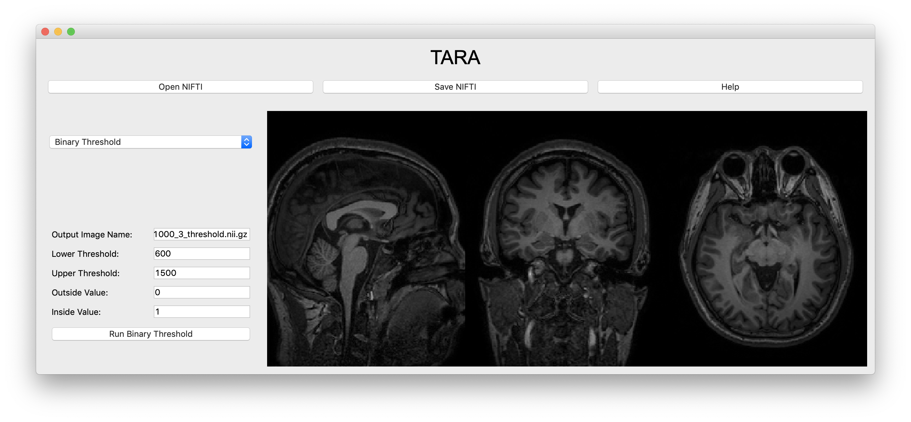
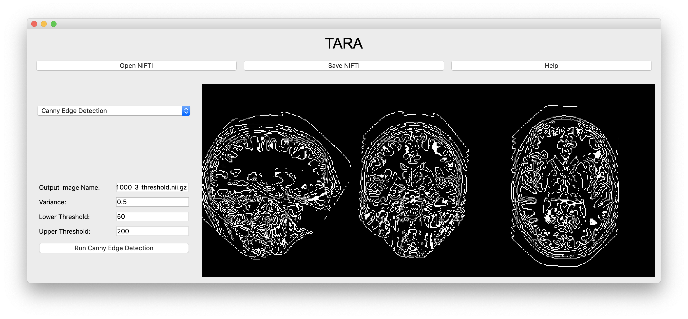

# TARA 

CS 8395 Final Project

> A fully-integrated, end-to-end visualization and analysis application to ascertain preliminary quantification of medical imaging data, in an intuitive and abstracted manner so as to be used by a wide audience, regardless of pre-existing knowledge with respect to medical imaging. 

Aadarsh Jha, Ashwin Kumar, Terry Luo, Raahul Natarrajan

<em><strong>Figure 1:</strong> The regular interface of TARA.</em>

<em><strong>Figure 2:</strong> An example of filtering in TARA.</em>

## I. Background Information

Imaging has become an essential component in medicine, namely biomedical research and clinical practice. Biomedical researchers and clinicians have a wide variety of medical imaging visualization tools and frameworks such as 3D Slicer, MIPAV, ITK, VTK, FSL, Osiris, etc. In this class, we have learned of Slicer, ITK, and VTK as a method of understanding and analyzing medical images. However, to the layperson, the usage of such tools often requires domain-specific knowledge and understanding of particular medical imaging processes and algorithms. Furthemore, if the task is simply to obtain preliminary quantification of a certain dataset, such tools can be ineffective in their ability to provide quick, seamless, and efficient results. 

Herein, we attempt to solve two central problems with common medical imaging platforms: 1) the different medical imaging analysis frameworks and platforms are not beginner-friendly, and often require domain-level expertise for proper quantification of results; and 2) to reduce the barrier in obtaining preliminary results by producing a highly-abstracted platform for clinicians, students, and beginners alike. Namely, the uniqueness of our efforts may be found in the simplicity and abstraction of our platform, which strives to promote a quick and efficient exploration, discovery, and analysis of medical imaging data without added “bells and whistles” to individuals of all experiences and knowledge of medical imaging. Specifically, our framework will provide seamless support for basic medical imaging tasks by providing an abstracted, visual layer to the ITK and VTK frameworks.

## II. Abstract 

In this project, we propose a fully-integrated, end-to-end visualization and analysis web application to ascertain preliminary quantification of medical imaging data, in an intuitive and abstracted manner so as to be used by a wide audience, regardless of pre-existing knowledge with respect to medical imaging. Furthemore, we propose that our platform will be educationally useful in promoting the usage and wide dissemination of common medical imaging tasks and algorithms. Our goal is to utilize a wide array of data in the development of our platform, and allow for the finalized product to encourage the user to input their own imaging data. We argue that this platform will meet our goals of 1) creating a beginner-friendly medical imaging platform that does not require domain-level expertise for proper quantification of results, and 2) promoting the usage of our platform for the faster, and more efficient, collection of preliminary data that can be validated by the the typical clinical workflow of large-scale medical imaging software. Throughout this project, we expect that the specific tools we will be using are Python, C++, SQL, HTML, and CSS in order to build up our application and communicate data. Furthermore, we also expect to use ITK and Slicer in order to fulfill being able to compute baseline results and validate the effectiveness of our platform. 

### III. Hypothesis 

We expect that the system we create will greatly simplify the workflow of medical image processing by abstracting out domain-specific knowledge from the application and simplifying the user interface to the extent that novices can easily understand and navigate the application. Fundamentally, we foresee that our system will make the task of processing medical images more intuitive and efficient, as well allowing for obtaining preliminary quantification of the data in a more effective and faster manner.

### IV. Evaluation Of Results 

We will evaluate our system by comparing the time it takes for a user to perform tasks using our system compared to Slicer or ITK. In this manner, we can validate our system in a simulated clinical workflow. The tasks that we will perform to evaluate the performance of both systems are image segmentation, image registration, and simple filtering. Using these tasks, we will be able to determine whether a novice can easily perform medical image processing using our system as opposed to a system such as Slicer. Furthermore, we will also evaluate how accurate our workflow is relative to the canonical, and publicly available, platforms of Slicer and ITK. For instance, if one performs Brain MRI segmentation, we will evaluate, both quantitatively and qualitatively, the performance of our platform’s segmentation to the segmentation that would be outputted by Slicer or ITK. 

### V. Data
	
In the production of our application, we will utilize a diverse array of different medical imaging MRI scans that are publically available. For instance, such websites offer open-source data upon which our application can operate: http://openfmri.org/, https://www.slicer.org/, or even https://github.com/sfikas/medical-imaging-datasets. In this sense, we will develop a system in which our testing data is varied so as to allow for our platform to be generalized. Furthermore, after the production of our software, we will allow the user to upload their own data, in addition to a well-selected publicly available dataset that can easily demonstrate core functionality such as segmentation, registration, or simple filtering.

### VI. Team Members and Role Assignments 

Our team comprises of Aadarsh Jha, Ashwin Kumar, Raahul Natarrajan, and Terry Luo. In context of our project, we divide our work into four main sections: 1) full-stack development of the visualization portal; 2) the collection, sourcing, and normalization of data; 3) the application, and understanding, of certain medical imaging processes which are reasonable to create, to replicate, and to apply to our dataset; and 4) the testing and assurance behind the accuracy of our tool, which includes applying our framework to a particular medical imaging analysis, such as segmentation or registration. 	

Namely, Aadarsh will primarily work on the development of the application, and will utilize resources to learn more about and apply different frameworks to build the GUI and allow for the communication of the data between different endpoints. Terry will work on abstraction of our chosen functionalities to the required key parameters in ITK, produce the code, and demonstrate that these functionalities have adequate performance across a range of parameters. Specifically, Terry will be charged with understanding the essential tools in ITK and Slicer, write the code so as to generalize these functionalities, and integrate such code with the large-scale application being built. Raahul will develop an integrated environment for the development and deployment of the system using continuous integration and continuous deployment techniques. He will engineer the backbone of the computational framework for the medical image processing and verify it using invariant techniques. Namely, Raahul will work on the “back-end” of the application, and will understand how to take Terry’s abstracted code and integrate it into the full-stack application. Finally, Ashwin will perform fundamental functionality and tasks in the 3D Slicer and ITK tools to obtain baseline results to be able to compare to the output of the software. Additionally, Ashwin will be charged with primarily helping with the quality assurance of our software, as well as ensuring seamless testing, integration, and application to different medical imaging tasks. Overall, Ashwin is in charge of the “evaluation of results” portion of our experimentation, in which he will extensively verify the validity of our methodology and our end product. 

Of course, we expect there to be overlap between the roles, particularly as we finish up each milestone (as seen in section VII) and integrate the four different tasks together to create a uniformly functioning platform for easier medical image analysis and visualization. 

## VII. Timeline

We plan on following the below timeline so as to maintain regular milestones and deliverables to ensure completion of our project: 

1. 10/13: Confirm exact functionalities to abstract from and reduce the parameters of those functionalities to their most essential. For instance, we would like to choose which inputs or sliders to use as parameters for registration, segmentation, and other related tasks. 
2. 10/13: Obtain a diverse set of data across different aspects of the human body from publicly available data sources. 
3. 11/1: Have a non-GUI (e.g. CLI) version of our simplified tool. 
4. 11/1: Finish image viewing tool in application, which means that we will be able to visualize sample data without modification.
5. 11/10: Migrate ITK functionality to application, which will primarily compose of our “back-end”. 
6. 11/10: Add instructions, educational tidbits, and complete “front-end” of the application. 
Post-Thanksgiving: Project completion, which includes a fully-integrated application that receives and sends data, and is able to parse through results and visualize it to the user. We will primarily be testing our application in this part of the project timeline. 
